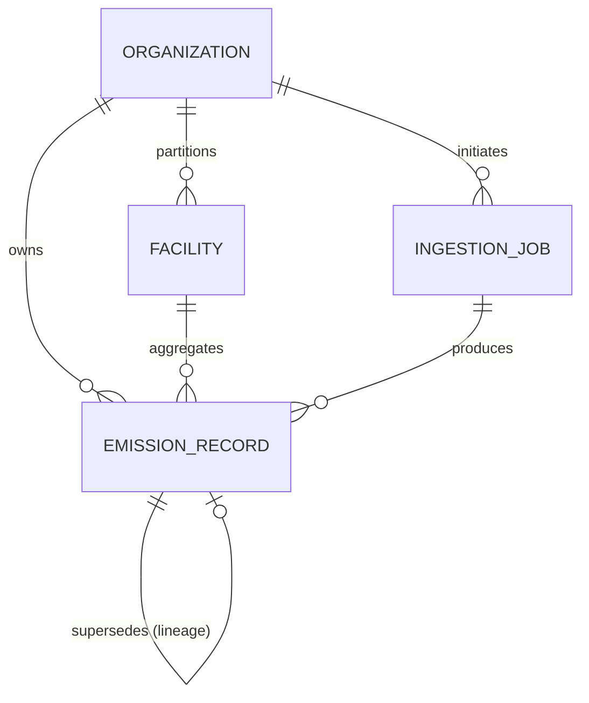

# Breathe ESG — Data Model Architecture (`MODEL.md`)

This document defines the persistent database layer for the Breathe ESG carbon accounting platform, implemented in `backend/models.py`. The schema is designed to meet strict enterprise audit requirements under the **GHG Protocol Corporate Standard** and **Green Button ESPI Standard**.

---

## 1. Entity-Relationship Architecture

The following diagram illustrates the relationship between the top-level tenant organization, facilities, transactional emission facts, and bulk ingestion audit logs:

---

## 2. Core Architectural Standards

### 🛡️ Multi-Tenancy & Data Isolation
To serve multiple enterprise clients on a single SaaS instance, a **Row-Level Tenancy** model is implemented:
*   **The Tenant Root (`Organization`):** All records strictly partition under an `organization_id` foreign key.
*   **Rationale:** Schema-per-tenant creates massive operational overhead during database migrations, and database-per-tenant is highly expensive. Row-level multi-tenancy (isolated at the ORM query layer using strict filters like `.filter(organization=request.user.organization)`) provides the optimal balance of scale, search speed, and reliable data boundary isolation.

### 📊 Scope 1 / 2 / 3 Categorization
The `EmissionRecord` fact table implements native classification matching the **GHG Protocol Standard**:
1.  **Scope 1 (Direct Fuel/Procurement):** direct combustion events linked to physical plants (mapped via `Facility`).
2.  **Scope 2 (Indirect Purchased Electricity):** billing summaries resolved to monthly calendars using Green Button ESPI parameters.
3.  **Scope 3 Category 6 (Business Travel):** employee-level expenses resolved dynamically from IATA codes using spherical geometry.

### 🔍 Source-of-Truth Tracking & Immutability
*   **`raw_payload` (JSONField):** Original, unmodified data payloads (e.g. raw CSV rows, ESPI JSON structures) are saved directly inside this immutable column. If an calculation error is disputed by an auditor, the source data remains fully inspectable.
*   **Lineage & Recalculation (`superseded_by`):** Historical emission records are **never edited in place**. If an estimated utility bill is replaced by an actual read, or emission factors change:
    1.  A new `EmissionRecord` is created containing the updated metrics.
    2.  The old record transitions to the `SUPERSEDED` status.
    3.  The old record's `superseded_by` foreign key is set to point to the new record, establishing a clear, uninterrupted audit lineage.

### ⚖️ Unit Normalization
Raw corporate data arrives in heterogeneous, legacy units. The ingestion views translate and normalize these into **standard SI units** before database commit:
*   **Liquids** (e.g., Gallons, Barrels, Cubic Meters) ➔ Normalized to **Liters** (`L`).
*   **Solids/Mass** (e.g., Pounds, Kilograms, Tons) ➔ Normalized to **Metric Tons** (`MT`).
*   **Electricity** (e.g., Kilowatt-hours) ➔ Normalized to Green Button ESPI **Watt-hours** (`Wh`).
*   **Emissions** (CO₂ equivalent) ➔ Always stored in **Kilograms of CO₂e** (`kg_co2e`) with 4-decimal precision for granular math, and scaled to Metric Tons only in the frontend reporting views.

### 📜 Clear Audit Trail
Every transaction is tracked through:
*   **Audit Stamps:** `created_by`, `created_at`, `approved_by`, `approved_at`, and free-text `analyst_comment`.
*   **Audit Lifecycle State Machine:** 
    $$\text{PENDING} \longrightarrow \begin{cases} \text{VALIDATED} \\ \text{ESTIMATED} \end{cases} \longrightarrow \begin{cases} \text{APPROVED} \\ \text{REJECTED} \\ \text{SUPERSEDED} \end{cases}$$

---

## 3. Database Schema Definitions

### 1. `Organization` (Tenant Root)
| Field | Type | Description |
| :--- | :--- | :--- |
| `id` | `AutoField` | Primary Key. |
| `name` | `CharField(255)` | Legal company name. |
| `slug` | `SlugField` | Unique slug for multi-tenant routing. |
| `reporting_currency` | `CharField(3)` | Default currency (e.g., "USD", "EUR") for finance aggregations. |
| `ghg_protocol_boundary` | `CharField(50)` | consolidation approach (`operational_control`, `equity_share`, or `financial_control`). |

### 2. `Facility` (Physical Site Dimension)
| Field | Type | Description |
| :--- | :--- | :--- |
| `id` | `AutoField` | Primary Key. |
| `organization` | `ForeignKey(Organization)` | Strict isolation check (Tenant Owner). |
| `sap_werks_code` | `CharField(20)` | Unique SAP MM plant code (joins raw procurement data to physical sites). |
| `name` | `CharField(255)` | Office, factory, or warehouse name. |
| `city` / `country` | `CharField(100)` | Geographic indicators for region-specific emission factor lookup. |

### 3. `EmissionRecord` (Core Transaction Fact Table)
| Field | Type | Description |
| :--- | :--- | :--- |
| `id` | `AutoField` | Primary Key. |
| `organization` | `ForeignKey(Organization)` | Strict isolation check. |
| `facility` | `ForeignKey(Facility, null=True)` | Physical facility context (Null for Scope 3 employee travel). |
| `superseded_by` | `ForeignKey(self, null=True)` | Self-referencing link to track data correction lineage. |
| `scope` | `IntegerField` | Scope enum (`1` = Scope 1, `2` = Scope 2, `3` = Scope 3). |
| `source_type` | `CharField(20)` | Original system enum (`UTILITY`, `SAP`, or `TRAVEL`). |
| `status` | `CharField(20)` | Audit state (`PENDING`, `VALIDATED`, `ESTIMATED`, `APPROVED`, `REJECTED`, `SUPERSEDED`). |
| `period_start` / `period_end` | `DateField` | Precise date boundary for overlapping calendar year calculations. |
| `kg_co2e` | `DecimalField(14,4)` | Exact equivalent greenhouse gas impact. |
| `raw_quantity` / `raw_unit` | `DecimalField` / `CharField` | Unprocessed quantity/unit metrics as originally received. |
| `emission_factor_version` | `CharField(100)` | Factors file dataset version used (e.g., "DEFRA 2023"). |
| `emission_factor_value` | `DecimalField(10,6)` | Multiplier constant applied (kg CO2e per unit) for complete auditable proof. |
| `raw_payload` | `JSONField` | Immutable, raw source data payload. |
| `espi_quality_of_reading` | `CharField(5)` | Green Button ESPI quality code (`8` = Estimated, `14` = Validated). |
| `employee_id` | `CharField(50)` | Corporate employee code (Scope 3 travel references). |
| `travel_category` | `CharField(20)` | Category indicator (`FLIGHT`, `HOTEL`, `GROUND_TRANSPORT`). |
| `created_by` / `approved_by` | `ForeignKey(User)` | Identity audit links mapping to platform analysts/approvers. |
| `approved_at` | `DateTimeField` | Time of auditor sign-off. |
| `analyst_comment` | `TextField` | Free-text compliance explanations and audit review justifications. |

### 4. `IngestionJob` (Bulk Upload Ingestion Log)
| Field | Type | Description |
| :--- | :--- | :--- |
| `id` | `AutoField` | Primary Key. |
| `organization` | `ForeignKey(Organization)` | Strict isolation check. |
| `source_type` | `CharField(20)` | Source type enum (`SAP`, `UTILITY`, or `TRAVEL`). |
| `filename` | `CharField(255)` | Original uploaded filename for audit matching. |
| `status` | `CharField(20)` | Status enum (`PROCESSING`, `COMPLETED`, `PARTIAL`, `FAILED`). |
| `total_rows` | `IntegerField` | Total lines in CSV. |
| `processed_rows` / `skipped_rows` | `IntegerField` | Detailed row processing metrics. |
| `validation_log` | `JSONField` | Array of row-by-row warnings/errors returned during processing. |
| `created_by` | `ForeignKey(User)` | Analyst who initiated the upload. |
| `created_at` / `completed_at` | `DateTimeField` | Upload duration timestamps. |
